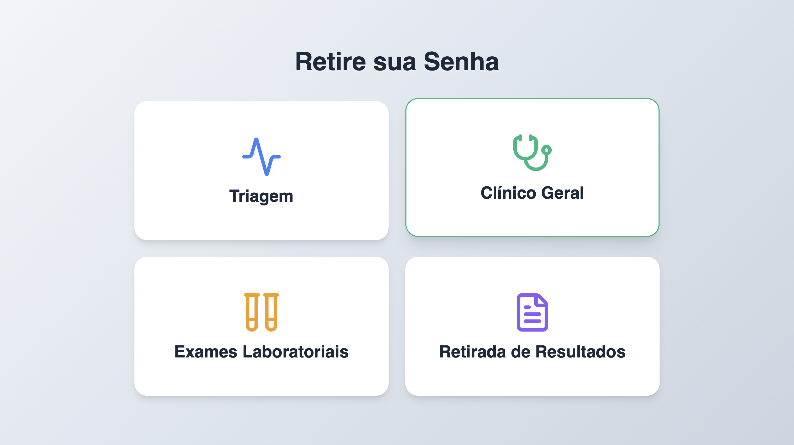
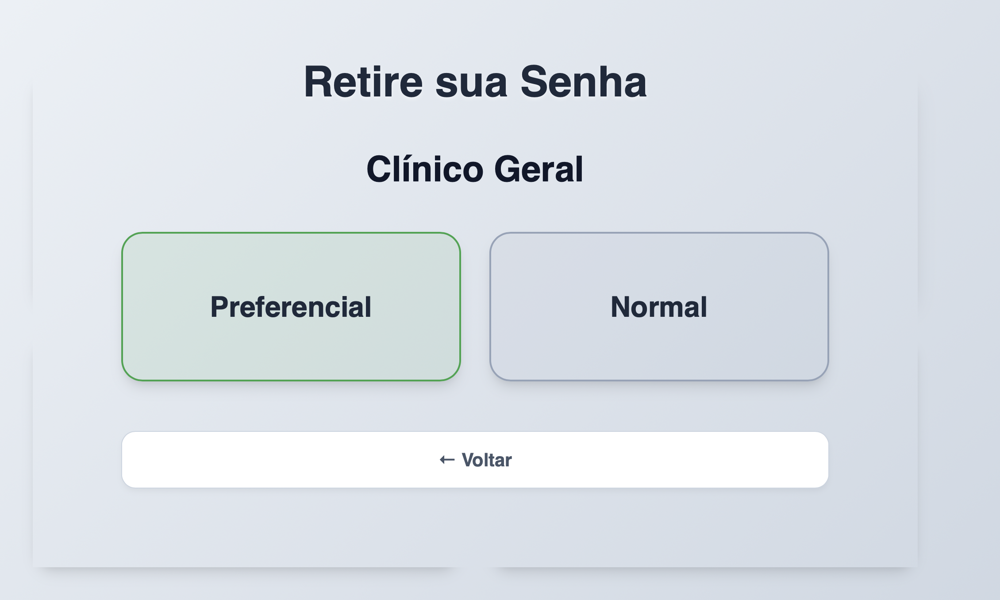
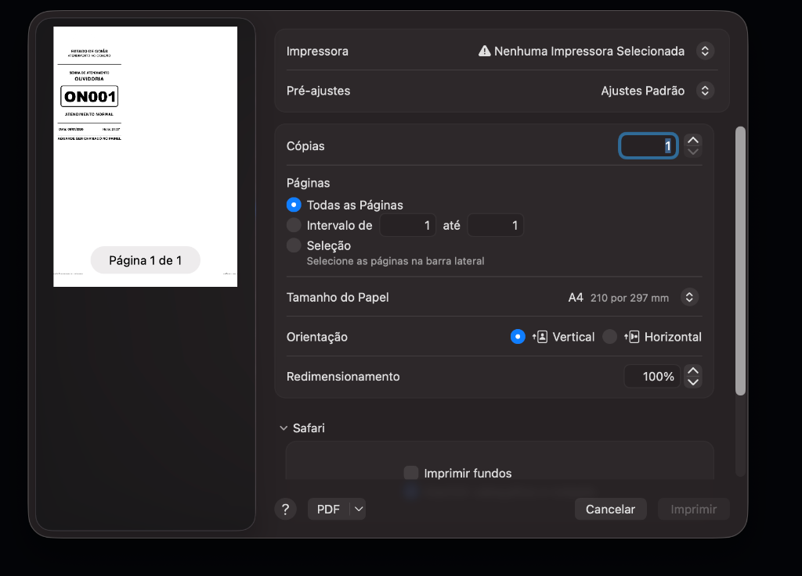
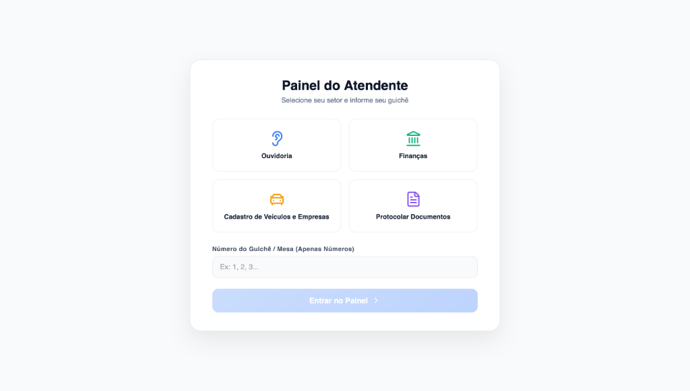
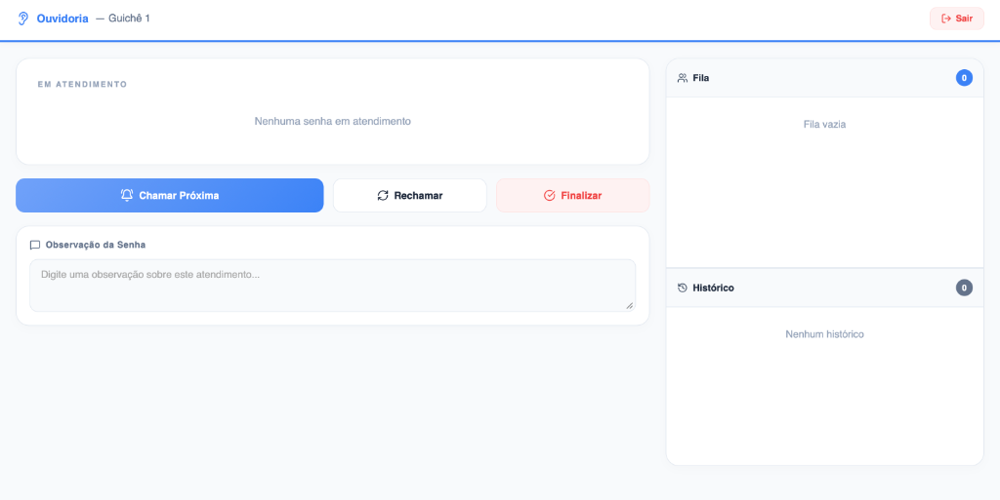
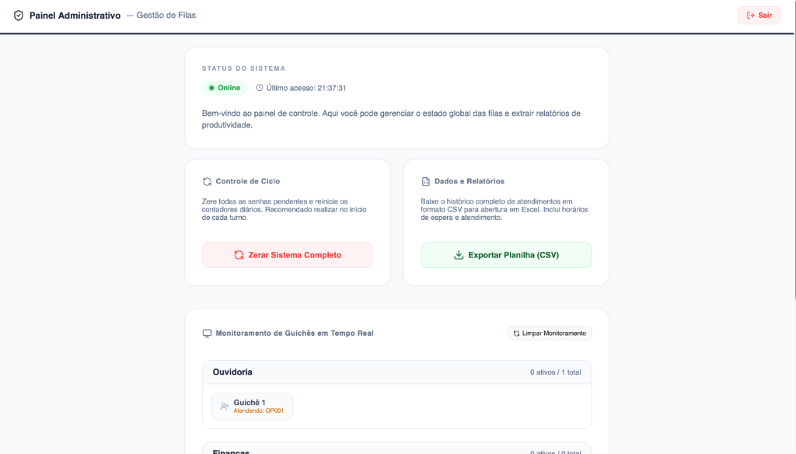

<p align="center">
  
</p>

<h1 align="center">Gestor de Filas de Atendimento</h1>

<p align="center">
  Sistema completo de gerenciamento de filas e notícias. Uma solução moderna, robusta e em tempo real para otimizar o atendimento ao cidadão.
</p>

<p align="center">
  
  
  
  
  
</p>

---

## Funcionalidades Principais

*   **Painel de TV (Display):** Transmissão de notícias em tempo real via RSS, exibição de senhas chamadas e avisos sonoros/voz sintetizada.
*   **Totem de Autoatendimento:** Interface intuitiva para emissão de senhas (Normal e Preferencial) dividida por categorias (Ouvidoria, Finanças, Veículos, etc.).
*   **Painel do Atendente:** Controle completo de chamadas, rechamadas, finalização de atendimentos com observações e histórico individual.
*   **Dashboard Administrativo:** Monitoramento em tempo real de guichês ativos, estatísticas de ocupação e exportação de relatórios detalhados em CSV (Excel).
*   **Real-time:** Comunicação instantânea via WebSockets para chamadas de senhas sem atrasos.

---

## Tecnologias Utilizadas

### **Backend**
- **Python + FastAPI:** Alta performance e documentação automática.
- **SQLite:** Banco de dados leve e eficiente para histórico de atendimentos.
- **WebSockets:** Comunicação bidirecional para eventos em tempo real.
- **BeautifulSoup4 + HTTPX:** Web scraping assíncrono para as últimas notícias.

### **Frontend**
- **React.js + Vite:** Interface moderna, rápida e responsiva.
- **Lucide React:** Conjunto de ícones elegante e profissional.
- **CSS3 Personalizado:** Design premium com efeitos de glassmorphism e animações suaves.

---

## Como Rodar o Projeto

### **Inicialização Simplificada (Recomendado para Windows)**

O projeto conta com um script automatizado que verifica os requisitos, instala as dependências necessárias e inicializa tanto o backend quanto o frontend em janelas de terminal visíveis para fácil monitoramento e depuração.

Para rodar o sistema:

1. Instale o **Python 3.10+** (certifique-se de marcar a opção **"Add Python to PATH"** durante a instalação).
2. Instale o **Node.js** (versão LTS recomendada).
3. Dê dois cliques no arquivo **`iniciar.bat`** na raiz do projeto. Ele cuidará do restante automaticamente!
4. Para encerrar o sistema, basta fechar as duas janelas de terminal abertas ou dar dois cliques no arquivo **`parar.bat`** (que encerrará de forma limpa os processos nas portas correspondentes).

---

### **Configuração Manual (Passo a Passo)**

Caso prefira fazer a instalação manualmente via terminal:

#### **1. Backend (API)**
Certifique-se de ter o Python 3.10+ instalado.

```bash
# Instale as dependências
pip install fastapi uvicorn beautifulsoup4 httpx

# Inicie o servidor
python backend/main.py
```
*A API ficará disponível em http://localhost:8001*

#### **2. Frontend (Interface)**
Certifique-se de ter o Node.js instalado.

```bash
# Entre na pasta frontend
cd frontend

# Instale as dependências
npm install

# Inicie o modo de desenvolvimento
npm run dev
```
*O sistema abrirá em [http://localhost:5173](http://localhost:5173). As seguintes rotas estão disponíveis:*

*   **Painel da TV (Display):** [http://localhost:5173/tv](http://localhost:5173/tv)
*   **Totem de Autoatendimento:** [http://localhost:5173/totem](http://localhost:5173/totem)
*   **Painel do Atendente:** [http://localhost:5173/atendente](http://localhost:5173/atendente)
*   **Dashboard Administrativo:** [http://localhost:5173/admin](http://localhost:5173/admin)


## Integração de Autenticação LDAP (Recomendado)

Para implantação em ambientes corporativos ou governamentais, recomenda-se a integração de login através de um servidor **LDAP (Lightweight Directory Access Protocol)** ou **Active Directory (AD)**.

### Benefícios:
*   **Single Sign-On (SSO):** Permite que atendentes e administradores utilizem as mesmas credenciais de rede corporativas já existentes.
*   **Gestão Centralizada:** Facilita o controle de acessos, controle de permissões e revogação de credenciais diretamente pelo setor de TI.
*   **Conformidade de Segurança:** Alinhamento com as políticas de segurança de informação do órgão público ou empresa.

### Sugestão de Implementação:
1.  **Backend (FastAPI):** Integração com bibliotecas como `ldap3` ou `python-ldap` para autenticar as credenciais no servidor LDAP e, após o sucesso, emitir um token JWT para as sessões do painel de atendente e administrativo.
2.  **Frontend (React):** Adaptação do formulário de login para receber usuário e senha do domínio, transmitindo-os de forma segura (HTTPS) para o endpoint de validação.

---

## Demonstração do Fluxo do Sistema

### **Fluxo do Totem de Autoatendimento**
Interface utilizada para a triagem e retirada de senhas (pelo próprio cidadão ou por um atendente local).

| 1. Seleção do Setor | 2. Tipo de Atendimento (Normal/Pref) | 3. Visualização e Impressão do Ticket |
| :---: | :---: | :---: |
|  |  |  |

---

### **Fluxo do Painel do Atendente**
Interface onde os atendentes realizam login vinculando ao guichê e gerenciam as chamadas.

| 1. Seleção do Setor e Guichê | 2. Controle de Fila e Chamadas (Chamar/Rechamar) |
| :---: | :---: |
|  |  |

---

## Estrutura do Projeto

```text
├── backend/
│   ├── data/          # Banco de Dados SQLite (atendimentos.db)
│   ├── routes/        # Rotas da API (admin, news, queue)
│   ├── config.py      # Configurações do servidor
│   ├── database.py    # Conexão e setup do banco
│   ├── models.py      # Esquemas de dados (Pydantic/SQL)
│   ├── news_service.py# Lógica de extração de notícias
│   ├── websocket.py   # Gerenciamento de conexões em tempo real
│   └── main.py        # Ponto de entrada (Uvicorn)
├── frontend/
│   ├── src/
│   │   ├── components/# Componentes React
│   │   ├── config.js  # Configuração de URLs e Setores
│   │   ├── App.jsx    # Roteamento principal
│   │   └── main.jsx   # Inicialização do React
├── iniciar.bat
└── parar.bat
```

---

## Relatórios e Dados
Os dados de atendimento são salvos permanentemente em `backend/data/atendimentos.db`. Você pode exportar o histórico completo para Excel através do botão **Exportar Planilha** no Painel Administrativo, além de monitorar guichês ativos em tempo real e extrair dados de produtividade para Ouvidoria, Finanças e outros setores.

<p align="center">
  
</p>

---

**Desenvolvido por:**
- **Lucas Lustosa Coelho**
- **Leonardo Ferreira Amichi**

*"Inovação e Eficiência no Atendimento Público"*
